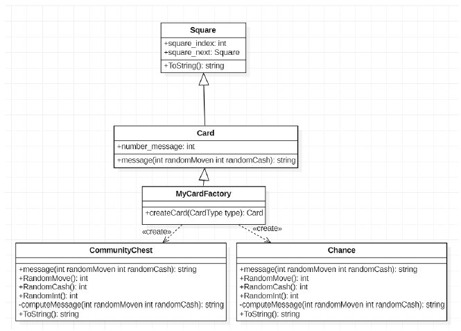
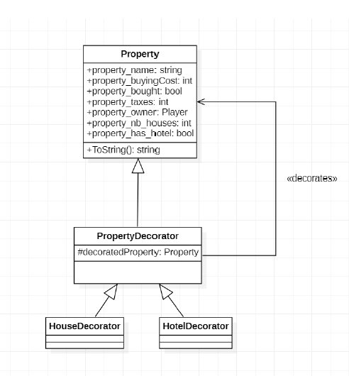
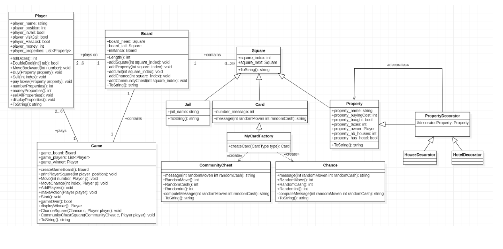
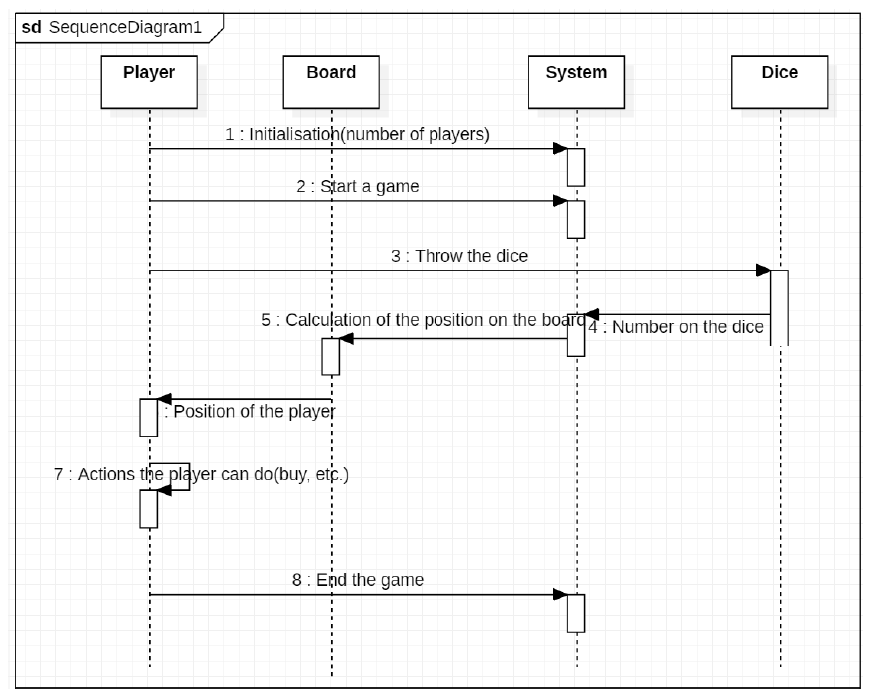

# Monopoly using design patterns

## Intoduction
The purpose of our project is to simulate a simplified version of the Monopoly game.
We have a set of players. Each player is defined by a name and an initial position. The game board is composed of 40 positions, indexed from 0 to 39. The position 10 on the game board refers to the square where the player only visits the jail. The position 30 on the game board refers to the square where the player goes to jail. To determine the position of each player through the game, a dice is rolled.
Here, the assignment is to focus on a particular case: when the player goes to jail.

## Design Hypothesis
To simulate a Monopoly game, we chose to use several design patterns that we have seen in practical works:

### 1. The singleton pattern
This pattern is a creational design pattern. The specificity of the singleton pattern is that it restricts the instantiation of a class to one object. It ensures that a class has only one instance and provides global access to it.

We chose to apply this pattern for the creation of our game board. In fact, we thought that it would be useful to use the singleton pattern as we have only one board during a game. Moreover, the game board should be accessed by all the players.

### 2. The factory pattern
This pattern is a creational design pattern. The specificity of the factory pattern is that it allows the creation of objects without exposing the creation logic. 

We chose to apply this pattern for the creation of specific types of cards: Chance and Community Chest. Every time a player goes to the square Chance or Community_Chest, it generates a chance card or a community chest card.

### 3. The decorator pattern
This pattern is a structural design pattern. The decorator pattern allows the addition of new functionality to an existing object, without altering its structure. 

We used this design pattern in order to add houses or a hotel to a property of the board.

## UML Diagrams
To simulate a Monopoly game, we chose to use several design patterns that we have seen in practical works:

### 1. Class diagram of the solution
The class diagram represented below is the diagram we used to create our C# model.

This model is particularly efficient because it also lists the attributes, methods, and additional information about the classes.

### 2. Sequence diagram
After initializing the game, each player collects his dice value, and the system calculates his new square. 
Finally, the pawn can be moved to the new square. This is possible because the system knows the board, the position of each player and the number on the dice, so it can return the new position of the player.

